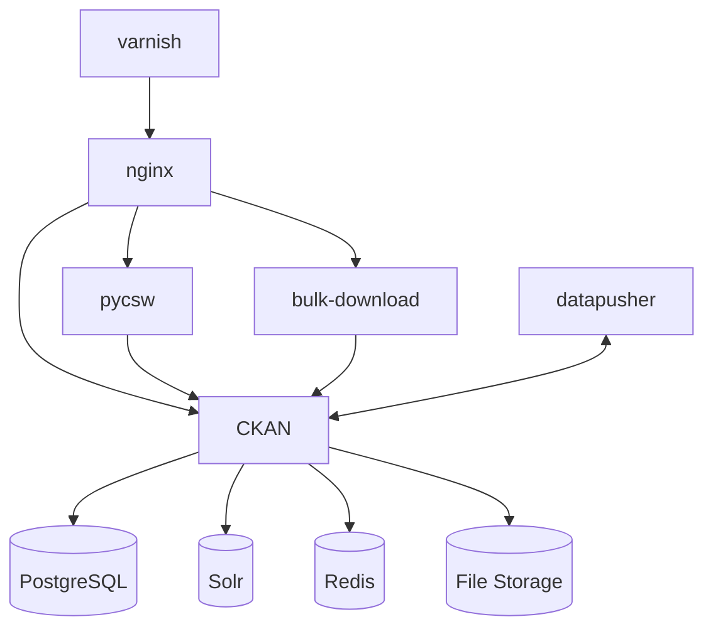

# COAT Data Portal (nina-ckan-coat)

[](https://gitlab.com/nina-data/nina-ckan-coat/commits/master)

A customized [CKAN](https://ckan.org/) data catalog for the **Climate-ecological Observatory for Arctic Tundra (COAT)** project, developed by [NINA](https://www.nina.no/) (Norwegian Institute for Nature Research).

## Overview

This repository contains a complete, production-ready deployment of CKAN tailored for managing ecological and climate monitoring data from Arctic tundra research. The portal enables researchers to publish, discover, and share datasets with full DOI citation support and spatial search capabilities.

### Key Features

- 🗂️ **Multi-type Dataset Management** - Supports datasets, state variables, protocols, and data management plans
- 🔄 **Dataset Versioning** - Track and search different versions of datasets
- 🌍 **Spatial Search** - Find datasets by geographic location and extent
- 📑 **DOI Integration** - Automatic DOI minting via DataCite for published datasets
- 🔐 **OAuth2 Authentication** - Federated authentication via Dataporten
- 📦 **Bulk Download** - Download multiple resources as a single ZIP archive
- 🌐 **CSW Support** - PyCSW integration for OGC Catalogue Service for the Web
- 📊 **DCAT Metadata** - Export COAT-compliant DCAT metadata for interoperability

### Architecture



### CKAN Extensions

| Extension | Purpose |
|-----------|---------|
| `ckanext-coat` | Core COAT functionality (versioning, resource protection, naming) |
| `ckanext-coatcustom` | COAT-specific schemas, spatial search, DOI citations |
| `ckanext-scheming` | Customizable dataset schemas |
| `ckanext-spatial` | Spatial metadata and search |
| `ckanext-harvest` | Data harvesting from external catalogs |
| `ckanext-doi` | DOI minting and DataCite integration |
| `ckanext-oauth2` | OAuth2 authentication (Dataporten) |
| `ckanext-datasetversions` | Dataset version management |
| `ckanext-dcat` | DCAT RDF serialization |
| `ckanext-iso19115` | ISO 19115 metadata support |
| `ckanext-metaexport` | Metadata export utilities |

## Requirements

**Operating System:** GNU/Linux (tested on Debian-based distributions)

**Dependencies:**
- Docker 20.10+ with Compose V2
- Python 3.8+ (for scripts only)
- Git with submodule support

## Quick Start

### Development Setup

```bash
# Clone the repository with submodules
git clone --recursive https://gitlab.com/nina-data/nina-ckan-coat.git
cd nina-ckan-coat

# Or if already cloned, fetch submodules
git submodule update --init --recursive

# Copy and configure environment
cp template.env .env
# Edit .env - at minimum set DOI_* test variables

# Build and run in development mode
docker compose --profile dev build
docker compose --profile dev run --rm --service-ports ckan-dev
```

The development server supports:
- Hot reloading for CKAN extensions (via volume mounts)
- Interactive debugging with `pdb`
- DOI test mode enabled by default

### Production Deployment

```bash
# Configure environment
cp template.env .env
# Edit .env and set:
#   - DOI_PREFIX, DOI_ACCOUNT_NAME, DOI_ACCOUNT_PWD
#   - CKAN_OAUTH2_* variables for authentication
#   - CKAN_SITE_URL for your domain

# Build and start
docker compose --profile prod build
docker compose --profile prod up -d
```

## Environment Variables

| Variable | Description | Required |
|----------|-------------|----------|
| `CKAN_SITE_URL` | Public URL of the CKAN instance | Yes |
| `CKAN_PORT` | Port to expose CKAN (default: 5000) | No |
| `POSTGRES_PASSWORD` | PostgreSQL admin password | Yes |
| `DATASTORE_READONLY_PASSWORD` | DataStore read-only password | Yes |
| `DOI_PREFIX` | DataCite DOI prefix | Yes (prod) |
| `DOI_ACCOUNT_NAME` | DataCite account name | Yes (prod) |
| `DOI_ACCOUNT_PWD` | DataCite account password | Yes (prod) |
| `DOI_TEST_MODE` | Enable DOI test mode | No (default: true) |
| `CKAN_OAUTH2_CLIENT_ID` | OAuth2 client ID | Yes (prod) |
| `CKAN_OAUTH2_CLIENT_SECRET` | OAuth2 client secret | Yes (prod) |
| `CKAN_MAX_UPLOAD_SIZE_MB` | Max upload size (default: 1000) | No |

## Testing

```bash
# Run integration tests with Docker Compose
docker compose --profile test down -v  # Clean up previous runs
docker compose --profile test run --rm test
```

Tests use SeleniumBase for browser automation and include:
- Homepage accessibility
- Dataset listing pages
- PyCSW endpoint validation

## Common Commands

```bash
# Create a sysadmin user
docker compose exec ckan ckan -c /etc/ckan/production.ini sysadmin add USERNAME

# Rebuild search index
docker compose exec ckan ckan -c /etc/ckan/production.ini search-index rebuild

# Access PostgreSQL
docker compose exec db psql -U ckan

# View CKAN logs
docker compose logs -f ckan

# Access Solr admin
# Open http://localhost:8983/solr/ in browser
```

## Development

### Project Structure

```
├── ckanext/                 # CKAN extensions (git submodules)
│   ├── ckanext-coat/        # Core COAT extension
│   ├── ckanext-coatcustom/  # COAT customizations and schemas
│   ├── ckanext-*/           # Other extensions
├── custom/                  # Custom entrypoints and requirements
│   ├── coat-entrypoint.sh   # Production entrypoint
│   └── coat-entrypoint-dev.sh
├── services/                # Supporting services
│   ├── bulk-download/       # ZIP download service
│   ├── nginx/               # Reverse proxy
│   ├── pycsw/               # OGC CSW service
│   └── varnish/             # HTTP cache
├── scripts/                 # Utility scripts
├── tests/                   # Integration tests
├── docker-compose.yml       # Service orchestration
├── Dockerfile               # CKAN image build
└── template.env             # Environment template
```

### Extension Development

The CKAN extensions are mounted as volumes in development mode, allowing live code changes:

```bash
# Edit extension code
vim ckanext/ckanext-coat/ckanext/coat/plugin.py

# Changes are reflected immediately (may need page refresh)
```

## Known Issues / Non-upstreamed Changes

- **ckanext-oauth2**: Python 3/CKAN 2.9 support via a stale PR ([#42](https://github.com/conwetlab/ckanext-oauth2/pull/42))
- **ckanext-scheming**: Custom patch to skip validation on parent datasets ([#331](https://github.com/ckan/ckanext-scheming/issues/331))