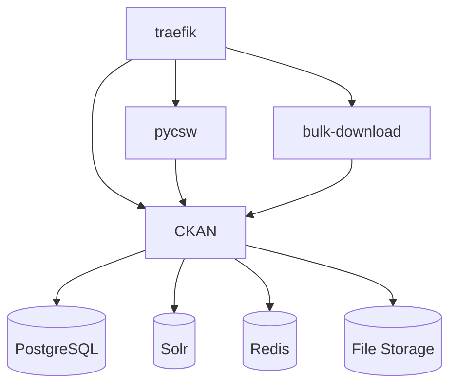

# COAT Data Portal (nina-ckan-coat)

[](https://gitlab.com/nina-data/nina-ckan-coat/commits/master)

A customized [CKAN](https://ckan.org/) data catalog for the **Climate-ecological Observatory for Arctic Tundra (COAT)** project, developed by [NINA](https://www.nina.no/) (Norwegian Institute for Nature Research).

## Overview

This repository contains a complete, production-ready deployment of CKAN tailored for managing ecological and climate monitoring data from Arctic tundra research. The portal enables researchers to publish, discover, and share datasets with full DOI citation support and spatial search capabilities.

### Key Features

- 🗂️ **Multi-type Dataset Management** - Supports datasets, state variables, protocols, and data management plans
- 🔄 **Dataset Versioning** - Track and search different versions of datasets
- 🌍 **Spatial Search** - Find datasets by geographic location and extent
- 📑 **DOI Integration** - Automatic DOI minting via DataCite for published datasets
- 🔐 **OAuth2 Authentication** - Federated authentication via Dataporten
- 📦 **Bulk Download** - Download multiple resources as a single ZIP archive
- 🌐 **CSW Support** - PyCSW integration for OGC Catalogue Service for the Web
- 📊 **DCAT Metadata** - Export COAT-compliant DCAT metadata for interoperability

### Architecture


```mermaid
flowchart TB
    traefik["traefik"] --> ckan["CKAN"]
    traefik --> pycsw["pycsw"]
    traefik --> bulk["bulk-download"]

    pycsw --> ckan
    bulk --> ckan

    ckan --> db[("PostgreSQL")]
    ckan --> solr[("Solr")]
    ckan --> redis[("Redis")]
    ckan --> storage[("File Storage")]
```

### CKAN Extensions

| Extension | Purpose |
|-----------|---------|
| `ckanext-coat` | Core COAT functionality (versioning, resource protection, naming) |
| `ckanext-coatcustom` | COAT-specific schemas, spatial search, DOI citations |
| `ckanext-scheming` | Customizable dataset schemas |
| `ckanext-spatial` | Spatial metadata and search |
| `ckanext-doi` | DOI minting and DataCite integration |
| `ckanext-oauth2` | OAuth2 authentication (Dataporten) |
| `ckanext-datasetversions` | Dataset version management |

## Requirements

**Operating System:** GNU/Linux (tested on Debian-based distributions)

**Dependencies:**
- Docker 20.10+ with Compose V2
- Python 3.8+ (for scripts only)
- Git with submodule support

## Quick Start

### Development Setup

```bash
# Clone the repository with submodules
git clone --recursive https://gitlab.com/nina-data/nina-ckan-coat.git
cd nina-ckan-coat

# Or if already cloned, fetch submodules
git submodule update --init --recursive

# Copy and configure environment
cp template.env .env
# Edit .env - at minimum set DOI_* test variables

# Build and run in development mode
docker compose --profile dev build
docker compose --profile dev run --rm ckan-dev
```

The development server supports:
- Hot reloading for CKAN extensions (via volume mounts)
- Interactive debugging with `pdb`
- DOI test mode enabled by default
- A fixed sysadmin user created automatically on startup when `CKAN_ADMIN_PASSWORD` is set in `.env`:
  - **Username:** `admin`  **Password:** value of `CKAN_ADMIN_PASSWORD` (default: `administrator`)

### Production Deployment

```bash
# Configure environment
cp template.env .env
# Edit .env and set:
#   - DOI_PREFIX, DOI_ACCOUNT_NAME, DOI_ACCOUNT_PWD
#   - CKAN_OAUTH2_* variables for authentication
#   - CKAN_SITE_URL for your domain

# Build and start
docker compose --profile prod build
docker compose --profile prod up -d
```

## Environment Variables

| Variable | Description | Required |
|----------|-------------|----------|
| `CKAN_SITE_URL` | Public URL of the CKAN instance | Yes |
| `CKAN_PORT` | Port to expose CKAN (default: 5000) | No |
| `POSTGRES_PASSWORD` | PostgreSQL admin password | Yes |
| `DATASTORE_READONLY_PASSWORD` | DataStore read-only password | Yes |
| `DOI_PREFIX` | DataCite DOI prefix | Yes (prod) |
| `DOI_ACCOUNT_NAME` | DataCite account name | Yes (prod) |
| `DOI_ACCOUNT_PWD` | DataCite account password | Yes (prod) |
| `DOI_TEST_MODE` | Enable DOI test mode | No (default: true) |
| `CKAN_OAUTH2_CLIENT_ID` | OAuth2 client ID | Yes (prod) |
| `CKAN_OAUTH2_CLIENT_SECRET` | OAuth2 client secret | Yes (prod) |
| `CKAN_MAX_UPLOAD_SIZE_MB` | Max upload size (default: 1000) | No |

## Testing

There are two test suites, both run inside Docker against a live `ckan-test` instance:

| Suite | File | Description |
|-------|------|-------------|
| API integration | `tests/test_api.py` | CKAN API tests (package lifecycle, versioning, embargo, …) |
| E2E browser | `tests/base.py` | SeleniumBase browser automation |

### Run tests

```bash
docker compose --profile test build
docker compose --profile test run --rm test-api
docker compose --profile test run --rm test
```

> **Note:** `docker compose --profile test down -v` between runs clears the database for a clean state.

The `ckan-test` instance also creates the fixed sysadmin on startup (when `CKAN_ADMIN_PASSWORD` is set), so you can inspect test data in the web portal at `http://127.0.0.1:5000` while tests are running.

## Common Commands

```bash
# Create a sysadmin user
docker compose exec ckan ckan -c /etc/ckan/production.ini sysadmin add USERNAME

# Rebuild search index
docker compose exec ckan ckan -c /etc/ckan/production.ini search-index rebuild

# Access PostgreSQL
docker compose exec db psql -U ckan

# View CKAN logs
docker compose logs -f ckan

# Access Solr admin
# Open http://localhost:8983/solr/ in browser
```

## Development

### Project Structure

```
├── ckanext/                 # CKAN extensions (git submodules)
│   ├── ckanext-coat/        # Core COAT extension
│   ├── ckanext-coatcustom/  # COAT customizations and schemas
│   ├── ckanext-*/           # Other extensions
├── custom/                  # Custom entrypoints and requirements
│   ├── coat-entrypoint.sh   # Production entrypoint
│   └── coat-entrypoint-dev.sh
├── services/                # Supporting services
│   ├── bulk-download/       # ZIP download service
│   ├── pycsw/               # OGC CSW service
├── scripts/                 # Utility scripts
├── tests/                   # Integration tests
├── docker-compose.yml       # Service orchestration
├── Dockerfile               # CKAN image build
└── template.env             # Environment template
```

### Extension Development

The CKAN extensions are mounted as volumes in development mode, allowing live code changes:

```bash
# Edit extension code
vim ckanext/ckanext-coat/ckanext/coat/plugin.py

# Changes are reflected immediately (may need page refresh)
```

## Known Issues / Non-upstreamed Changes

### ckanext-oauth2

The CKAN ecosystem lacks a well-maintained OAuth2 extension. The history of our fork:

1. [conwetlab/ckanext-oauth2](https://github.com/conwetlab/ckanext-oauth2): the original extension (unmaintained)
2. [FedericOldani](https://github.com/FedericOldani) submitted a Flask/Python 3 conversion ([conwetlab#42](https://github.com/conwetlab/ckanext-oauth2/pull/42)), never merged
3. We ([COATnor](https://github.com/COATnor/ckanext-oauth2)) forked conwetlab, cherry-picked FedericOldani's work, added Feide `/userinfo` endpoint support and fixed `setup.py` for out-of-tree builds
4. [In-For-Disaster-Analytics](https://github.com/In-For-Disaster-Analytics/ckanext-oauth2) forked COATnor and added CKAN 2.11 support
5. We merged the changes back and improved `pyproject.toml`

We are now collaborating on joint maintenance ([issue #25](https://github.com/In-For-Disaster-Analytics/ckanext-oauth2/issues/25)) and submitted the dependency cleanup upstream ([PR #26](https://github.com/In-For-Disaster-Analytics/ckanext-oauth2/pull/26)).

### ckanext-scheming

We use a [COATnor fork](https://github.com/COATnor/ckanext-scheming/tree/skip-validation-if-parent) with one extra commit on top of upstream v3.1.0: it skips schema validation when the `__parent` flag is set during dataset creation. This is needed because COAT's versioning system creates lightweight parent datasets that don't conform to the strict custom schemas. See [ckan/ckanext-scheming#331](https://github.com/ckan/ckanext-scheming/issues/331) for the upstream discussion.

### ckanext-spatial

We maintain a [COATnor fork](https://github.com/COATnor/ckanext-spatial/tree/coat) that adds proper dependency declarations to `pyproject.toml`. Submitted upstream as [ckan/ckanext-spatial#352](https://github.com/ckan/ckanext-spatial/pull/352).

### ckanext-datasetversions

[aptivate/ckanext-datasetversions](https://github.com/aptivate/ckanext-datasetversions) is mostly unmaintained (see [issue #17](https://github.com/aptivate/ckanext-datasetversions/issues/17)). We maintain a [NINAnor fork](https://github.com/NINAnor/ckanext-datasetversions) with the following non-upstreamed changes:

- Flask blueprint migration (from Pylons)
- `__parent` parameter for parent dataset creation
- Create parent datasets with the same type as the child
- Move versions list to a reusable snippet
- Support for private dataset versions
- CKAN 2.10 compatibility

These should be submitted as PRs to aptivate (we have collaborator access).

### CKAN core

CKAN itself does not declare runtime dependencies in `pyproject.toml` (only `setuptools` in `install_requires`), requiring a [dummy package workaround](dummy/ckan/) to feed its pinned requirements into the resolver. We commented on [ckan/ckan#8382](https://github.com/ckan/ckan/issues/8382#issuecomment-4154186834) proposing to add dependencies to `pyproject.toml` and use `uv export` for pinning.